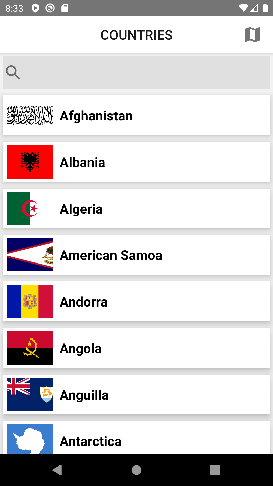
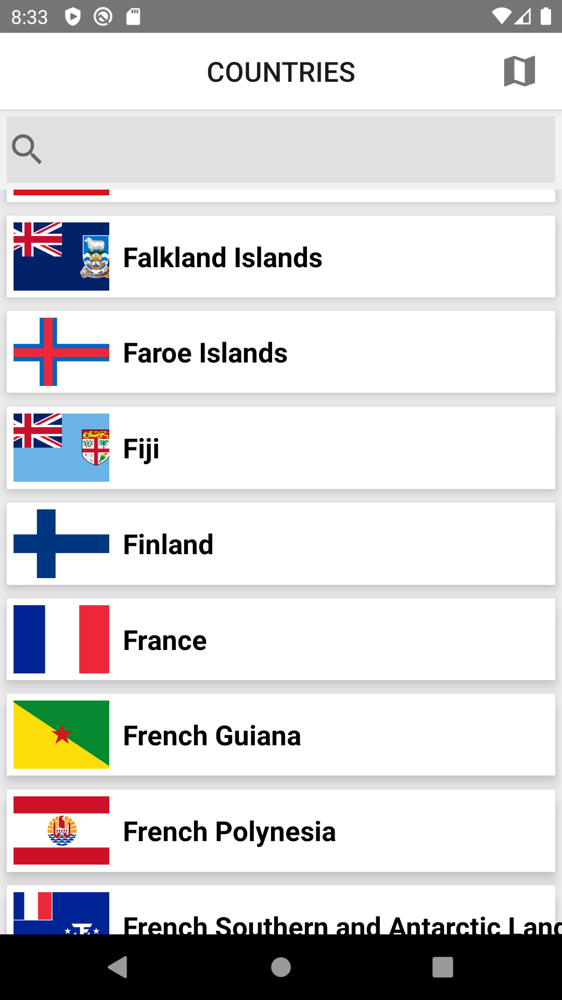
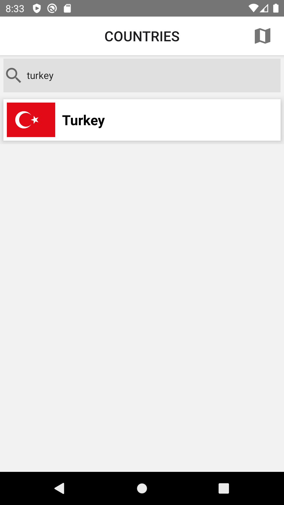
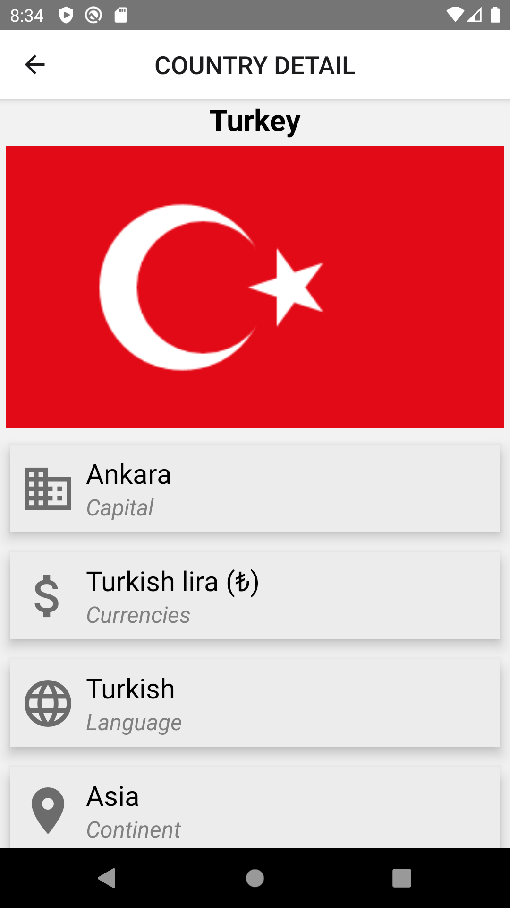
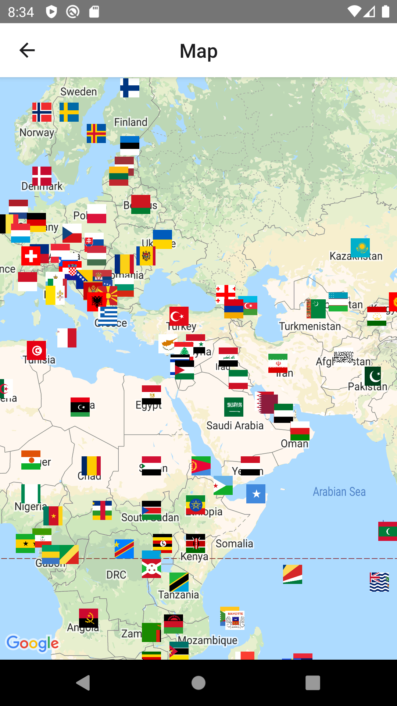
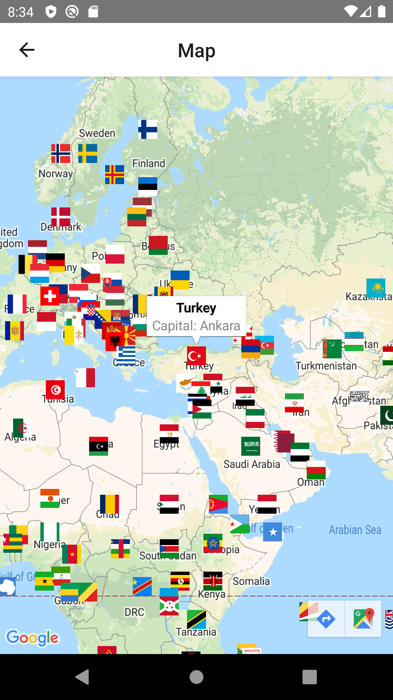

### Screenshots

  
  


## Installation

- [Install React Native](https://reactnative.dev/docs/environment-setup)

```
git clone https://github.com/OsmanAlperCAM/CountryApp.git
```

- npm install or yarn install for installing all the dependencies

- start your emulator or connect your physical device then start npm run android/ios(depending on your device)